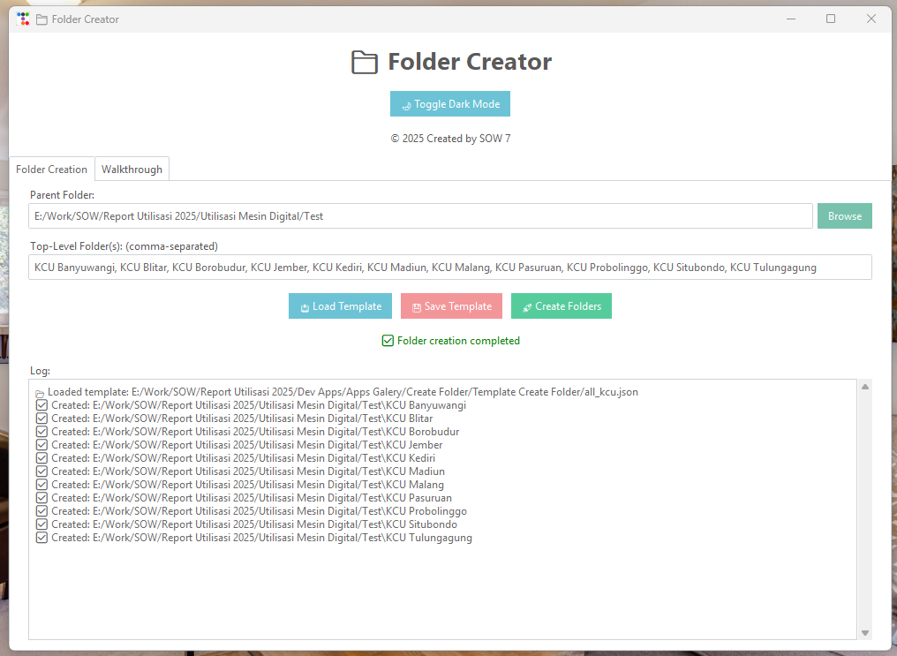
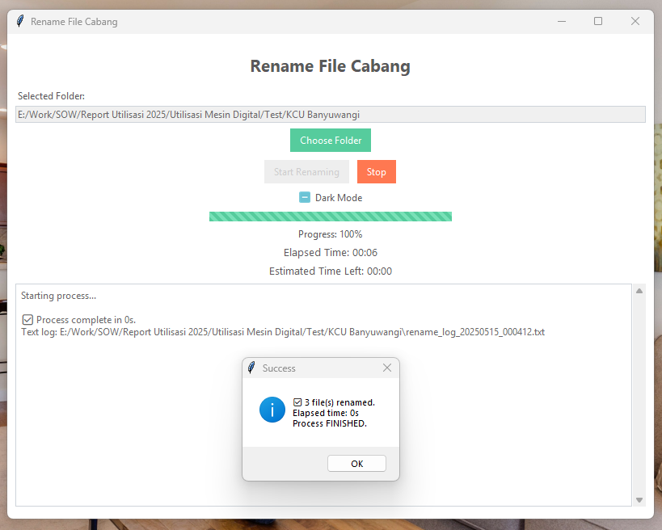
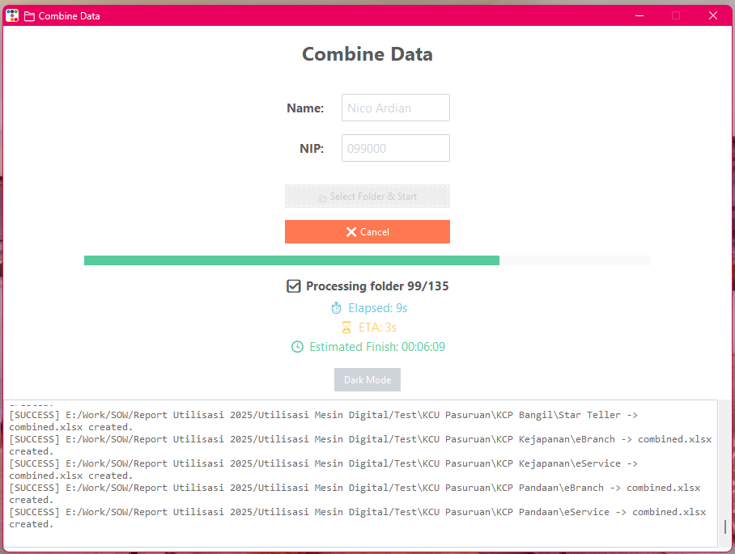
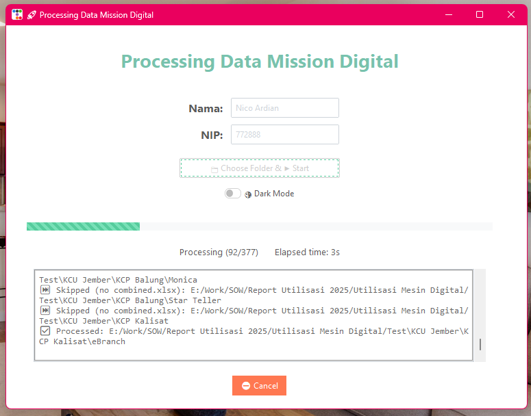
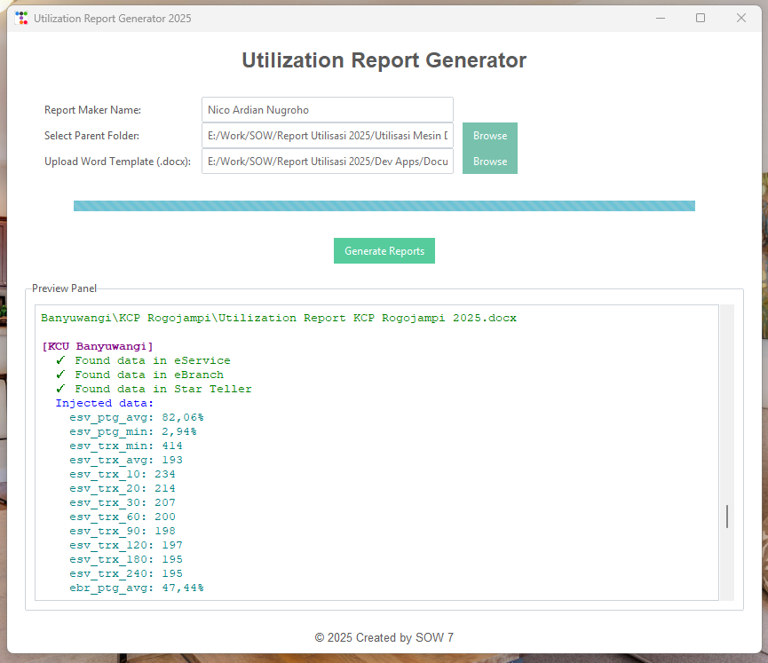
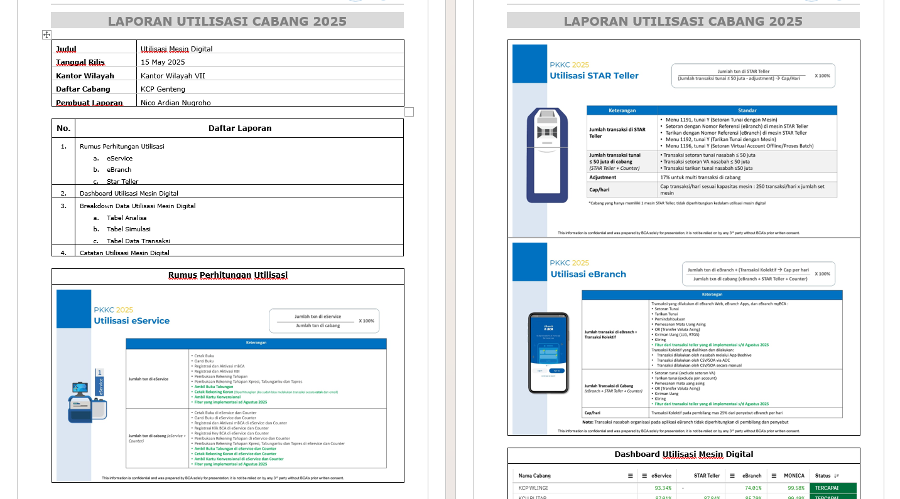
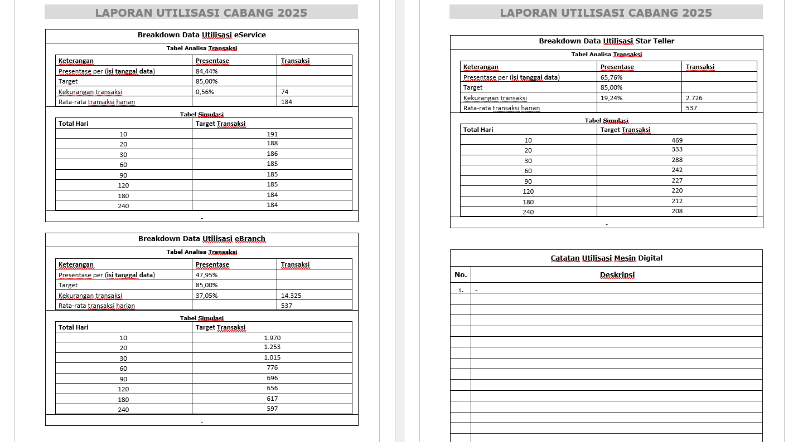

# 🚀 Dev Apps by Nico Ardian from SOW 7

**Dev Apps by Nico Ardian from SOW 7** is a curated collection of powerful desktop tools and automation scripts designed to simplify repetitive tasks, streamline workflows, and boost development productivity.

---

## 📦 Project Overview

| Component              | Description                                    |
|------------------------|------------------------------------------------|
| `Apps Galery/`                | GUI applications for file, report, and data tasks |
| `Script/`              | Python utilities to automate repetitive jobs  |
| `Documentation/`    | Setup guides and app usage instructions       |
| `Template Create Folder/`| List of folder creation templates              |
| `Startup/`| Applications that can be run in sequence              |

---

## 🖼️ App Previews

| App Name        | Screenshot                                 |
|------------------|--------------------------------------------|
| Folder Creator   |           |
| Rename FIle |         |
| Combine Data       |         |
| Processing Data   |        |
| Report Generator |         |

> 📌 Replace these placeholder images with real app screenshots to showcase your tools.
## 🖼️ Report Preview
| Page       | Screenshot                                 |
|------------------|--------------------------------------------|
| 1-2   |           |
| 3-4 |         |

## ⚙️ Built With

- **Python** – Core scripting
- **ttkbootstrap** – For modern GUIs
- **Pandas + OpenPyXL** – Excel data processing
- **docxtpl** – Word report generation
- **Matplotlib** – Data visualizations

---

## 🚀 Usage Workflow

    A[Start] --> B[Create Folder]
    B --> C[Rename File]
    C --> D[Combine Data]
    D --> E[Process Data]
    E --> F[Export Report]
    F --> G[Done and Check Log]

💡 Getting Started
Clone the repository:
git clone https://github.com/NicoAN42/Dev-Apps.git

🤝 Contributing
Contributions are welcome!
Fork the repo → Create a branch → Make changes → Submit a pull request.

📬 Contact
Found an issue or have a feature request?
Submit it on the Issues page.

⭐ If you like this project, give it a star on GitHub!
access github repository at https://github.com/NicoAN42/DevAppsSOW7

---

Thank You for Visiting My Code Playground !
